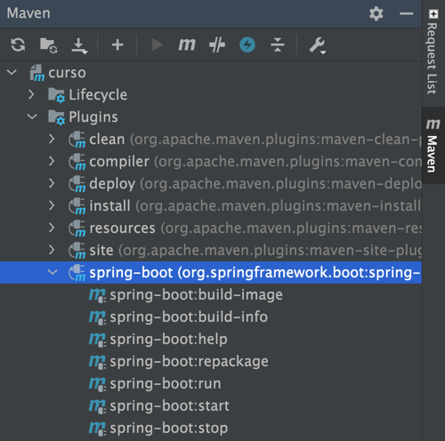

# About this project
This is an easy spring project done using the following tutorial
[link to tutorial](https://www.youtube.com/watch?v=7vHzVN0EiQc)
## Resource directory

Inside this directory you can find some configurations files, additionally you can put public files inside static directory. 
Those files could be consumed by the user, they could be images, videos etc...

## Maven commands

In IntelliJD you can find the maven commands used to control the spring server, you can control them through console, 
but using IntelliJD is easier.
